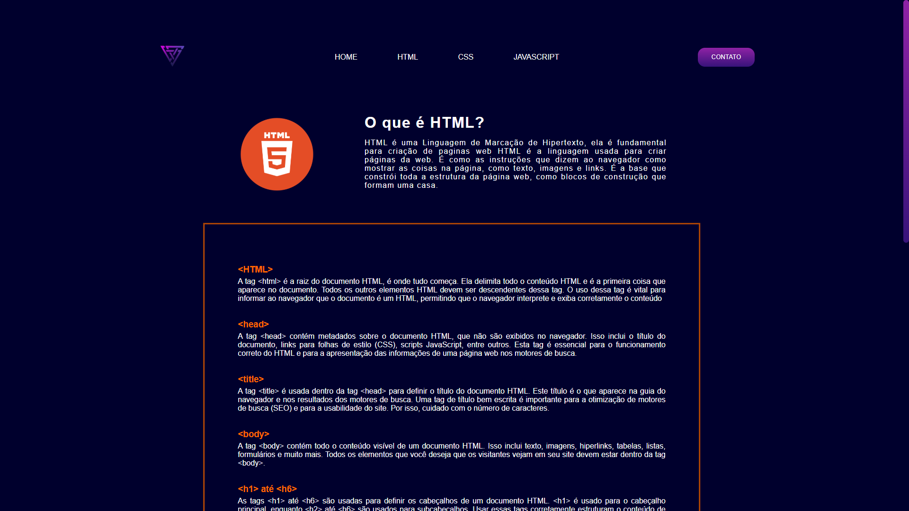
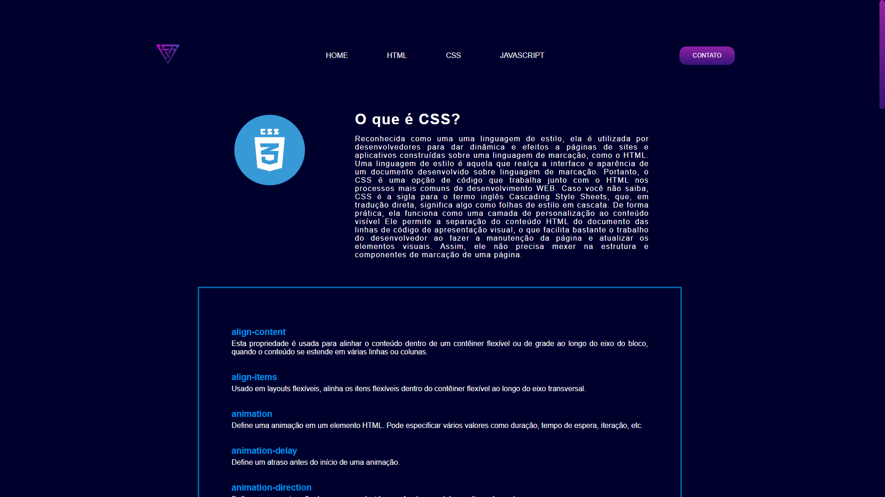
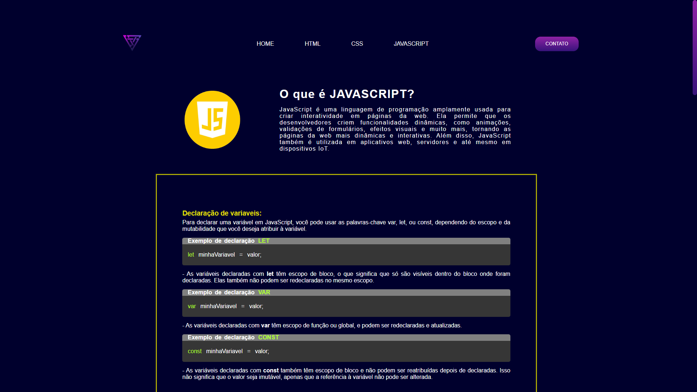

<h1>Front End</h1>
  

## Tópicos

 • <a href="#-sobre-o-projeto">Sobre o Projeto</a>  
 • <a href="#-tecnologias">Tecnologias</a>  
 • <a href="#-layout">Layout</a>  
 • <a href="#-funcionalidades">Funcionalidades</a>  
 • <a href="#-autor">Autor</a>  
 • <a href="#user-content--licença">Licença</a> 

## Sobre o projeto  

A página servia como um material didático interativo, explicando a função de cada uma dessas tecnologias na construção de sites. O conteúdo era dividido em seções, com explicações teóricas e exemplos práticos de código.

HTML 📜 → Explicava a estrutura básica de uma página web, incluindo tags essenciais como &lt;head&gt;, &lt;body&gt;, &lt;h1&gt;,&lt;p&gt; e &lt;img&gt;.

CSS 🎨 → Demonstrava como estilizar elementos HTML, utilizando seletores, cores, fontes e layouts com Flexbox/Grid.

JavaScript ⚡ → Mostrava como adicionar interatividade à página, com eventos e funções básicas.

Além disso, o site incluía exemplos de código que os alunos podiam copiar, modificar e testar, tornando o aprendizado mais dinâmico. 🚀

## Tecnologias
🔹 Front-end   
▪ HTML5 → Estrutura da interface. 
▪ CSS3 → Estilização. 
▪ Figma → Protótipo e design da interface.  

## Layout

💻 Algumas telas da Aplicação Web!

  

  <h2 align=center>HTML</h2>
  
  <h2 align=center>CSS</h2>
  
  <h2 align=center>JavaScript</h2>
  

## Funcionalidades

✔️ Explicação interativa: Cada tecnologia possui uma seção dedicada com explicações claras e objetivas sobre seu funcionamento.

✔️ Exemplos de código: Foram incluídos trechos de código HTML, CSS e JavaScript para que os alunos possam visualizar e compreender melhor cada linguagem.

✔️ Demonstrações práticas: O site permite que os alunos vejam exemplos funcionais de código em tempo real.

✔️ Design intuitivo: O layout foi pensado para facilitar a navegação e a leitura dos conteúdos.

Esse projeto ajuda professores e alunos a terem um material de apoio acessível e bem estruturado para o aprendizado de desenvolvimento web. 🚀

# Entre em contato

**Linkedin**: [LinkedIn](https://www.linkedin.com/in/jonathan-rubens-60975628a/)

Desenvolvido por **Jonathan Rubens** 👋🏻
